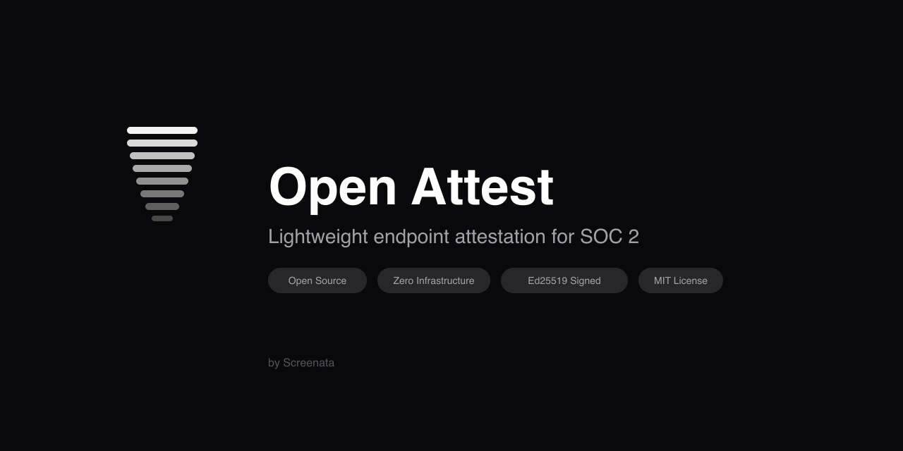
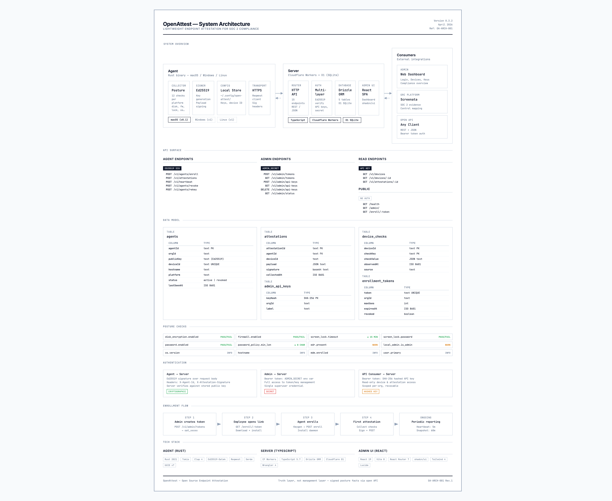

# open-attest



Lightweight, open-source endpoint attestation for SOC 2. Collects signed endpoint posture facts and exposes them through an open API — no MDM, no infrastructure, no complexity.

[](https://deploy.workers.cloudflare.com/?url=https://github.com/screenata/open-attest/tree/main/server)

## Why

Startups preparing for SOC 2 need endpoint evidence but don't need (or want) a full MDM. The usual options are manual screenshots, heavyweight device management platforms, or tools that cost more than your seed round.

open-attest is built for teams of 5-50 where the CTO is also the IT admin. Deploy the server in one click, install the agent in one command, and you have signed endpoint compliance evidence flowing in under 10 minutes.

- **Free to run** — Cloudflare Workers free tier handles ~50 devices
- **Zero infrastructure** — no servers, no databases to manage, no Docker
- **One command to install** — download binary, run `open-attest enroll`
- **Runs silently** — daemon starts on boot, reports hourly, no user interaction
- **Signed attestations** — Ed25519 signatures, tamper-evident, auditor-friendly
- **Cross-platform** — macOS, Windows, and Linux
- **Admin UI included** — dashboard, device list, compliance status, credential management
- **Open source** — inspect every check, every byte sent to the server

## What it does

open-attest runs on your team's laptops and reports security posture to a central server. It collects 23 posture checks:

- Disk encryption (FileVault / BitLocker / LUKS)
- Firewall status
- Screen lock timeout, password requirement, and MDM-managed lock policy
- OS version, hardware identity (manufacturer, model, serial)
- Third-party EDR/antivirus presence (CrowdStrike, SentinelOne, Sophos, Jamf Protect, ClamAV, etc.) — OS-built-in protection does not count, see below
- Linux Security Module enforcement (AppArmor / SELinux), reported separately from anti-malware
- Anti-malware definition currency — signature version and last-update timestamp (Defender for Endpoint on Windows, XProtect on macOS)
- Password policy and login password
- Local admin membership + full admin roster + full local-user roster
- MDM enrollment
- Auto security-update toggle (macOS)
- SSH daemon state and authorized-key count
- Installed application inventory (daily snapshot)

Every attestation is signed with Ed25519 so the server can verify it came from a registered agent and hasn't been tampered with.

## Architecture



- **Agent**: Rust binary (macOS, Windows, Linux), runs as a background daemon, collects posture checks, signs and submits attestations
- **Server**: TypeScript on Cloudflare Workers with D1 (SQLite) and Drizzle ORM. Zero infrastructure to manage. Free tier covers ~50 devices
- **Admin UI**: React SPA with shadcn/ui — dashboard, device compliance, credential management. Served from the same Worker
- **Screenata** (optional): Adds control mapping, policy evaluation, evidence generation, and auditor exports

## Quick start

### Deploy the server

```bash
cd server
npm install
cd admin && npm install && cd ..    # install admin UI deps
wrangler d1 create open-attest      # create D1 database
# Update wrangler.toml with the database_id from above
wrangler secret put ADMIN_SECRET    # set your admin secret
npm run db:migrate:production       # apply migrations
npm run deploy:production           # build admin UI + deploy
```

Or click the "Deploy to Cloudflare Workers" button above for one-click deploy.

### Set up

1. Open `https://your-worker.workers.dev/admin/` and log in with your admin secret
2. Go to **Credentials** → **Create Enrollment Token** (set max devices, e.g. 50)
3. Copy the enrollment link and share it with your team

### Install the agent

Employees open the enrollment link and follow the instructions, or run directly:

```bash
open-attest enroll --token <TOKEN> --server https://your-worker.workers.dev
```

The agent enrolls, installs a background daemon, and starts reporting automatically.

### CLI commands

```bash
open-attest check           # show posture checks with pass/fail status
open-attest check --json    # machine-readable JSON output
open-attest status          # show agent enrollment status
open-attest attest          # submit an attestation now
open-attest web             # open admin UI in browser
open-attest uninstall       # remove agent and daemon
```

## Agent checks

| Check | Key | Type | macOS | Windows | Linux | Status |
|-------|-----|------|-------|---------|-------|--------|
| Disk encryption | `disk_encryption.enabled` | bool | FileVault | BitLocker | LUKS / dm-crypt | Available |
| Firewall | `firewall.enabled` | bool | Application Firewall | Windows Firewall | ufw / iptables / firewalld | Available |
| Screen lock timeout | `screen_lock.timeout_minutes` | int | Screensaver idle time | Registry / powercfg | gsettings / KDE / XFCE | Available |
| Screen lock password | `screen_lock.password_required` | bool | sysadminctl | Registry | gsettings / KDE / XFCE | Available |
| Screen lock policy is MDM-enforced | `screen_lock.managed_by_mdm` | bool | profiles + Managed Preferences | — | — | Available |
| Login password set | `password.enabled` | bool | dscl authonly | net user | /etc/shadow | Available |
| Password policy | `password_policy.min_length` | int | pwpolicy | ADSI / net accounts | PAM / pwquality / login.defs | Available |
| Auto security-update enabled | `auto_update.security_enabled` | bool | com.apple.SoftwareUpdate prefs | — | — | Available |
| OS version | `os.version` | string | sw_vers | .NET Environment | /etc/os-release | Available |
| Hostname | `hostname` | string | hostname | hostname | hostname | Available |
| Primary user | `user.primary` | string | whoami | whoami | whoami | Available |
| Local users | `users.local` | string[] | dscl /Users | Get-LocalUser | /etc/passwd | Available |
| Local administrators | `users.admins` | string[] | dscl /Groups/admin | net localgroup Administrators | /etc/group (sudo/wheel) | Available |
| MDM enrollment | `mdm.enrolled` | bool | profiles | dsregcmd | N/A | Available |
| EDR/AV presence | `edr.present` | bool | Third-party process + system-extension scan | SecurityCenter2 + Defender | Anti-malware process scan | Available |
| LSM enforcing | `lsm.enforcing` | bool | — | — | aa-status / getenforce | Available |
| Anti-malware signature version | `edr.signature_version` | string | XProtect.bundle `CFBundleShortVersionString` | `Get-MpComputerStatus` AntivirusSignatureVersion | — | Available |
| Anti-malware definitions last updated | `edr.signature_last_updated` | string (RFC3339) | XProtect.bundle mtime | `Get-MpComputerStatus` AntivirusSignatureLastUpdated | — | Available |
| SSH daemon enabled | `ssh.daemon_enabled` | bool | launchctl | Get-Service sshd | systemctl + ps | Available |
| SSH authorized key count | `ssh.authorized_key_count` | int | ~/.ssh/authorized_keys scan | %ProgramData%\ssh + per-user | /home/*/.ssh + /root/.ssh | Available |
| Local admin (current user) | `local_admin.is_admin` | bool | dscl | net localgroup | /etc/group (sudo/wheel) | Available |
| Installed apps (daily snapshot) | `apps.installed` | string[] | system_profiler SPApplicationsDataType | HKLM/HKCU Uninstall registry | dpkg / rpm / pacman | Available |
| Device hardware | `device.manufacturer`, `device.model`, `device.serial_number` | string | system_profiler | WMI | DMI sysfs | Available |
| Browser extensions (daily snapshot) | `browser_extensions` | string[] | Safari + Chrome / Edge / Brave / Firefox profiles | Chrome / Edge / Brave / Firefox profiles | Chrome / Edge / Brave / Firefox profiles | Planned |
| App CVEs (derived from `apps.installed`) | `apps.cves` | string[] | offline CVE feed cross-ref | offline CVE feed cross-ref | offline CVE feed cross-ref | Planned |
| Browser enterprise policy | `browser.policies` | string[] | managed plist | managed registry | managed prefs | Planned |
| Dotfile secret heuristics | `secrets_in_dotfiles` | int | ~/.aws/credentials, ~/.ssh/id_*, ~/.netrc count | per-user | per-user | Planned |

`edr.present` reports third-party anti-malware only. On macOS it ignores Apple's built-in XProtect and MRT: `XProtect.bundle` ships with every macOS install, so counting it made the check return true on every Mac — useless as fleet-coverage evidence. On Linux it ignores AppArmor and SELinux, which are mandatory-access-control frameworks rather than anti-malware. Neither signal is discarded: XProtect's version and definition date are reported as `edr.signature_version` / `edr.signature_last_updated` with source `xprotect`, and LSM enforcement as `lsm.enforcing`. A host with no third-party agent now reports `edr.present = false`.

Heavy lists (`apps.installed`, planned `browser_extensions`) ship on a 24-hour cadence; everything else flows on every snapshot. Lists are capped at 1000 entries with a `…and N more` sentinel.

Other planned work outside the per-check table: server-side inventory search (`GET /v1/devices?app=<name>` to find every device running a given app or version); persisted inventory-cadence state so daemon restarts don't re-collect on every boot; opt-in username hashing in `CollectionConfig` for shared admin consoles.

## Compliance evaluation

The CLI and admin UI evaluate checks against default thresholds:

| Check | Rule | Status |
|-------|------|--------|
| Disk encryption | must be enabled | Pass / Fail |
| Firewall | must be enabled | Pass / Fail |
| Screen lock password | must be required | Pass / Fail |
| Login password | must be set | Pass / Fail |
| Auto security-update | must be enabled | Pass / Fail |
| Screen lock timeout | must be ≤ 15 minutes | Pass / Fail |
| Password min length | must be ≥ 8 characters | Pass / Fail |
| MDM enrollment | preferred when present | Pass / — |
| MDM-managed screen lock | preferred when present | Pass / — |
| EDR/AV presence | a third-party agent should be present | Pass / Warning |
| LSM enforcing | informational | — |
| Anti-malware definitions last updated | ≤ 7 days fresh, ≤ 30 days stale, older is a finding; empty is informational | Pass / Warning / Fail |
| Anti-malware signature version | informational | — |
| Local admin (current user) | user should not be admin | Pass / Warning |
| SSH authorized key count | warn if any keys present | Pass / Warning |
| SSH daemon enabled | informational | — |
| Local users / admins roster | informational | — |
| Installed apps | informational | — |

## API

All endpoints require authentication. Agent endpoints use Ed25519 signatures. Admin endpoints use API keys or the admin secret.

| Method | Path | Auth | Description |
|--------|------|------|-------------|
| GET | `/health` | None | Health check |
| GET | `/admin/` | None | Admin UI |
| GET | `/enroll/:token` | None | Enrollment page for employees |
| POST | `/v1/admin/api-keys` | Admin secret | Create API key |
| GET | `/v1/admin/api-keys` | Admin secret | List API keys |
| DELETE | `/v1/admin/api-keys` | Admin secret | Delete API key |
| POST | `/v1/admin/tokens` | Admin secret | Create enrollment token (multi-use) |
| GET | `/v1/admin/tokens` | Admin secret | List enrollment tokens |
| GET | `/v1/admin/status` | Admin secret | Server stats + compliance summary |
| POST | `/v1/agents/enroll` | Token | Enroll agent |
| POST | `/v1/agents/revoke` | API key | Revoke agent |
| POST | `/v1/agents/rekey` | Agent sig | Rotate key |
| POST | `/v1/attestations` | Agent sig | Submit attestation |
| POST | `/v1/heartbeat` | Agent sig | Heartbeat |
| GET | `/v1/devices` | API key | List devices |
| GET | `/v1/devices/:id` | API key | Device + posture checks |
| GET | `/v1/attestations/:id` | API key | Attestation detail |

## Securing the admin UI (recommended)

Protect the admin UI with Cloudflare Access for SSO + MFA — no code changes needed.

1. Go to Cloudflare dashboard → Zero Trust → Access → Applications
2. Click **Add an application** → Self-hosted
3. Set the domain to your Worker (e.g., `open-attest-server.your-subdomain.workers.dev`)
4. Set the path to `/admin/*`
5. Add a policy: allow emails ending in `@your-company.com`
6. Save

Now anyone accessing `/admin/` must authenticate through your identity provider (Google, GitHub, Okta, Azure AD, etc.) before reaching the admin UI. MFA is handled by the identity provider.

API endpoints (`/v1/*`) remain unprotected so agents can submit attestations without login.

Free for up to 50 users on the Cloudflare Zero Trust free plan.

## Building a .pkg installer (macOS)

For distributing to non-technical users:

```bash
cd agent/pkg
./build-pkg.sh --token <TOKEN> --server https://your-worker.workers.dev
```

Produces a `.pkg` that installs the agent and enrolls automatically.

## Development

### Server

```bash
cd server
npm install
cd admin && npm install && cd ..
npm run db:migrate:local    # apply migrations to local D1
npm run dev                 # build admin UI + start local server on :8787
npm test                    # run tests (32 tests)
```

To add a new migration after changing `src/schema.ts`:

```bash
npm run db:generate         # generate migration from schema changes
```

### Agent

```bash
cd agent
cargo build
cargo test                  # run tests (195 tests)
```

### Demo data

```bash
cd server
./scripts/seed-demo.sh      # seed 50 demo devices with realistic data
```

## Trust model

Attestations are best-effort, self-reported posture statements from the endpoint. Signatures prove origin authenticity and record integrity, but do not prove the endpoint is uncompromised or that every reported fact is unforgeable under full host compromise.

## Screenata

open-attest gives you the raw posture data. [Screenata](https://screenata.com) turns it into audit-ready compliance evidence.

- Map endpoint checks to SOC 2 controls
- Set pass/fail thresholds per org
- Generate evidence summaries for auditors
- Track drift and exceptions over time
- Export PDF/CSV reports with one click

open-attest + Screenata = endpoint compliance without the MDM.

## License

[MIT](LICENSE)
